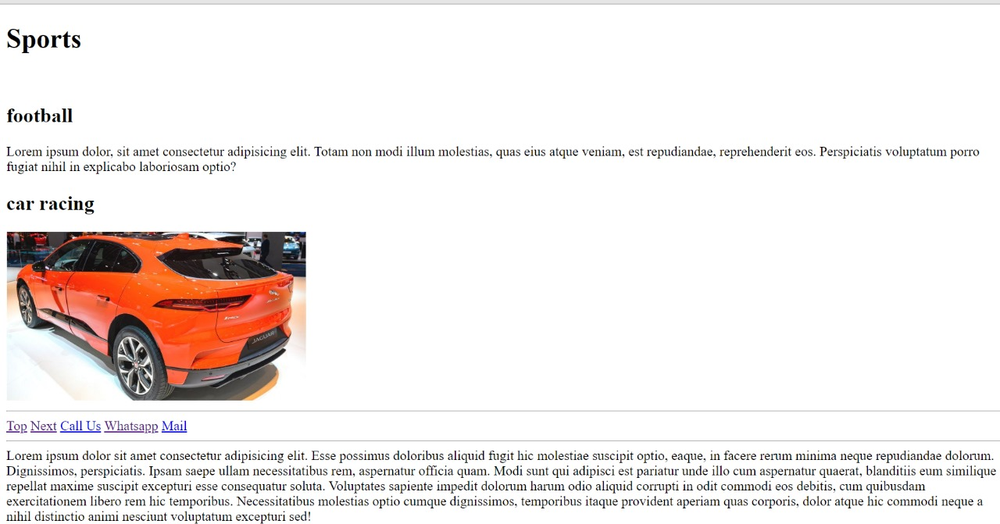
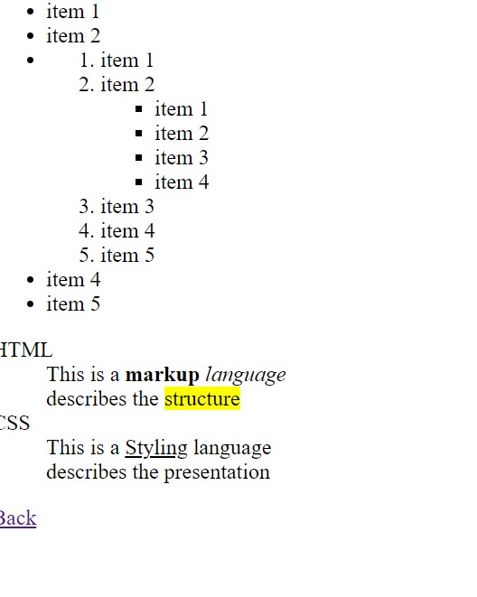
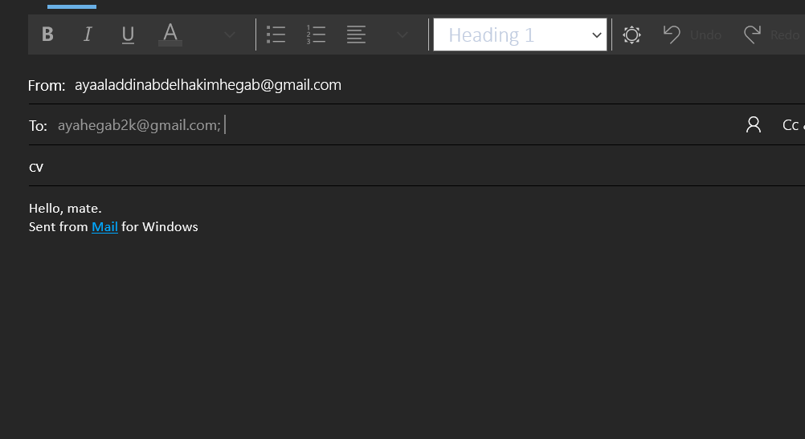

### Click On Wheels

A website that includes an image of a car. The wheels of the car are clickable as they redirect the user to a google search of the word "wheels". As shown in the [demonstration](https://youtu.be/Xzpy4AAUVxY).

It's a task for the ITI HTML/ CSS course.

## Requirements:

When click on send mail, the mail app will be launched with the subject of "cv" and the body of "Hello, mate".

